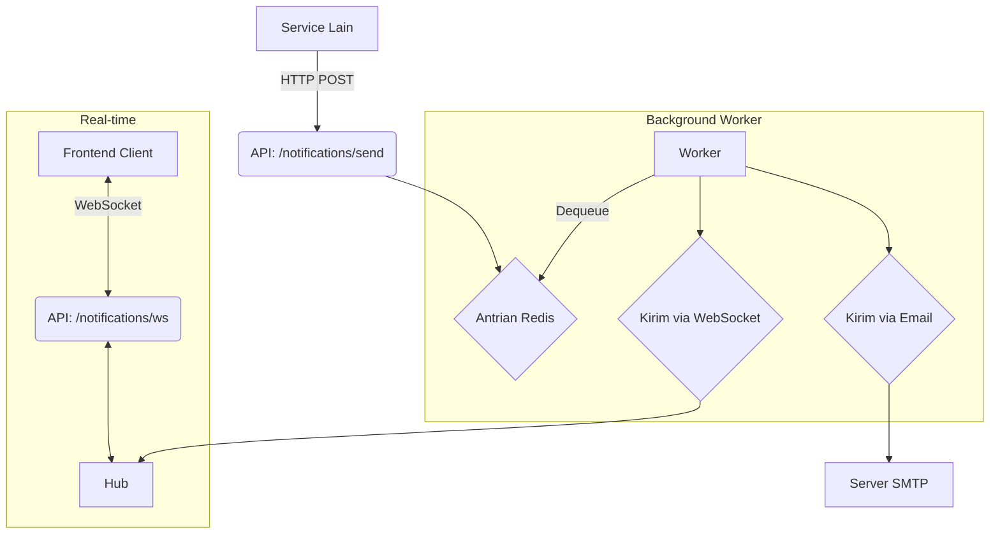

# 🔔 Prism Notification Service

Layanan notifikasi terpusat untuk ekosistem **Prism ERP**. Layanan ini bertanggung jawab untuk mengirimkan semua komunikasi keluar (email dan notifikasi real-time via WebSocket) secara andal dan terukur.

<!-- Badges -->
<p>
  <a href="https://github.com/Lumina-Enterprise-Solutions/prism-notification-service/actions/workflows/ci.yml">
    
  </a>
  <a href="https://github.com/Lumina-Enterprise-Solutions/prism-notification-service/actions/workflows/release.yml">
    
  </a>
  <a href="https://github.com/Lumina-Enterprise-Solutions/prism-notification-service/pkgs/container/prism-notification-service">
    
  </a>
  <a href="https://goreportcard.com/report/github.com/Lumina-Enterprise-Solutions/prism-notification-service">
    
  </a>
</p>

---

## ✨ Fitur Utama

-   **Pemrosesan Asinkron**: Menggunakan **Redis** sebagai *message queue* untuk menerima permintaan notifikasi secara cepat, memastikan layanan pengirim tidak terblokir.
-   **Notifikasi Multi-Channel**:
    -   **Email**: Pengiriman email menggunakan template HTML dinamis.
    -   **Real-time (WebSocket)**: Memberikan notifikasi instan kepada pengguna yang sedang online.
-   **Andal & Tangguh**: Jika pengiriman email gagal, job akan dicoba ulang beberapa kali sebelum dipindahkan ke *Dead-Letter Queue* (DLQ) untuk inspeksi manual.
-   **Observabilitas**: Terintegrasi penuh dengan **OpenTelemetry (Jaeger)** dan **Prometheus** untuk pemantauan end-to-end.
-   **Manajemen Rahasia**: Mengambil kredensial SMTP secara aman dari **HashiCorp Vault**.

---

## 🏗️ Arsitektur & Alur Kerja

Layanan ini memisahkan penerimaan permintaan dari proses pengiriman untuk meningkatkan skalabilitas dan ketahanan.



---

## 🔌 API Endpoints

Semua endpoint berada di bawah prefix `/notifications`.

| Metode | Path      | Deskripsi                                                        | Otentikasi? |
|:-------|:----------|:-----------------------------------------------------------------|:-----------:|
| `POST` | `/send`   | Menerima & memasukkan notifikasi ke dalam antrian pemrosesan.    | Tidak       |
| `GET`  | `/ws`     | Meng-upgrade koneksi HTTP ke WebSocket untuk notifikasi real-time. | **Ya (JWT)**|
| `GET`  | `/health` | Health check endpoint untuk monitoring dan service discovery.    | Tidak       |

### Body Request untuk `POST /send`

```json
{
  "recipient_id": "user-uuid-123",
  "recipient": "user.email@example.com",
  "subject": "Judul Notifikasi",
  "template_name": "welcome.html",
  "template_data": {
    "FirstName": "John"
  }
}
```

-   **Respons Sukses**: `202 Accepted` - Permintaan berhasil diterima.
-   **Respons Gagal**: `400 Bad Request` atau `500 Internal Server Error`.

---
<details>
<summary><b>🔑 Konfigurasi & Variabel Lingkungan</b></summary>

| Variabel        | Deskripsi                       | Default            | Dari Vault? |
|:----------------|:--------------------------------|:-------------------|:-----------:|
| `PORT`          | Port server HTTP.               | `8082`             | Tidak       |
| `REDIS_ADDR`    | Alamat Redis.                   | `cache-redis:6379` | Tidak       |
| `JAEGER_ENDPOINT`| Alamat kolektor Jaeger.         | `jaeger:4317`      | Tidak       |
| `VAULT_ADDR`    | Alamat HashiCorp Vault.         | `http://vault:8200`| Tidak       |
| `VAULT_TOKEN`   | Token untuk Vault.              | `root-token-for-dev`| Tidak       |
| `MAILTRAP_HOST` | Host server SMTP.               | -                  | **Ya**      |
| `MAILTRAP_PORT` | Port server SMTP.               | -                  | **Ya**      |
| `MAILTRAP_USER` | Username otentikasi SMTP.       | -                  | **Ya**      |
| `MAILTRAP_PASS` | Password otentikasi SMTP.       | -                  | **Ya**      |

</details>

---

## 🚀 Pengembangan Lokal

-   **Jalankan**: `make run` (memerlukan Vault & Redis berjalan).
-   **Uji**: `make test`
-   **Lint**: `make lint`
-   **Build Docker**: `make docker-build`

